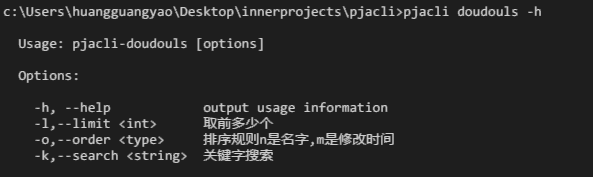

# pjacli

## Installation

1. easy code with cmd
`npm install -g http://10.17.1.139/zw/pjacli/repository/archive.tar.gz?ref=master`

2. config your env Variables

## Features

1. list doudou game
    `pjacli doudouls` 列出豆豆游戏
    帮助见`pjacli doudouls -h`
    
2. build doudou game with doudouls output
    `pjacli doudouls -k 63 | pjacli doudoubuild ` 搜索游戏目录下63开头的游戏并构建他们
    帮助见`pjacli doudoubuild -h`
    

3. 传入游戏配置（见demo目录的a.json）输出一个html（有配置的游戏的名字，链接和二维码），作为一个标准化的提交形式
    帮助见`pjacli doudouqr -h`
    
    值得注意的是依赖了qr生成器依赖了node-canvas,这个得要windows编译so，自己google一下吧~
